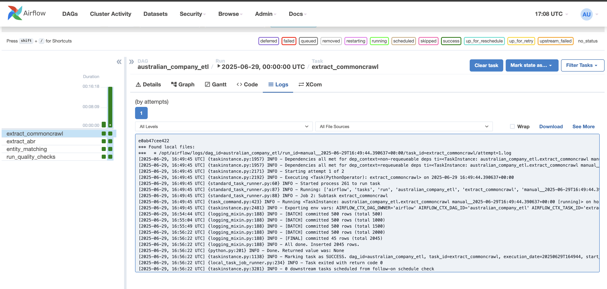
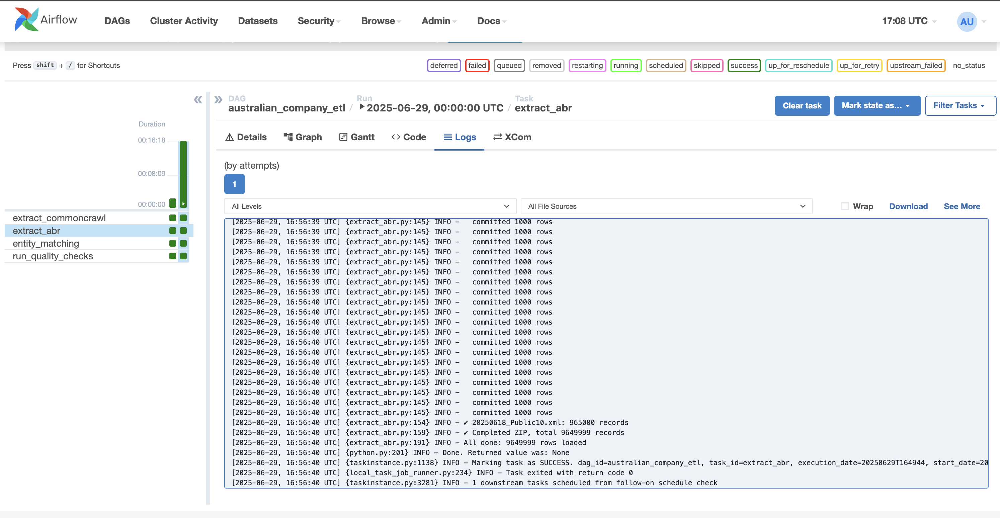
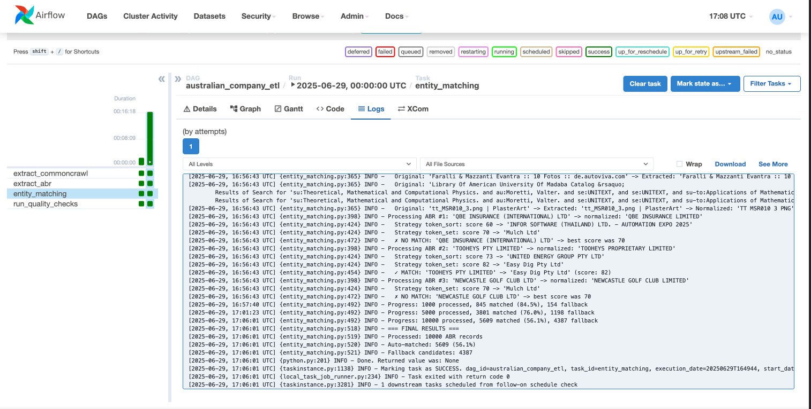
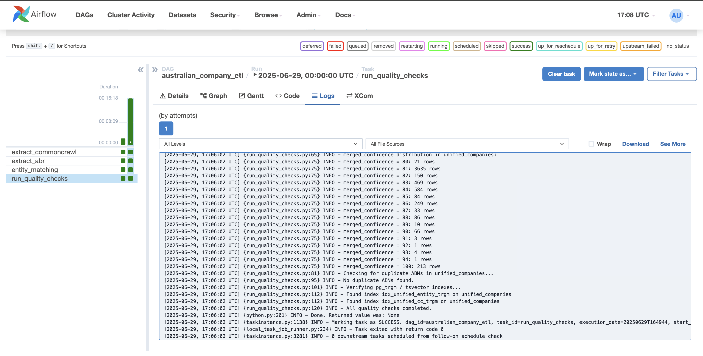

# README.md

## Detailed database schema (PostgreSQL DDL)

The unified company data is stored in a normalized PostgreSQL schema.

```sql
CREATE TABLE companies (
    id SERIAL PRIMARY KEY,
    abn VARCHAR(20),
    entity_name TEXT,
    entity_type TEXT,
    entity_status TEXT,
    address TEXT,
    postcode TEXT,
    state TEXT,
    start_date DATE,
    website_url TEXT,
    industry TEXT
);

CREATE INDEX idx_abn ON companies (abn);
CREATE INDEX idx_website_url ON companies (website_url);
```

- All DDL scripts are in `sql/schema.sql`.

---

## Pipeline architecture diagram and description

### Architecture Diagram

```
t1 (extract_commoncrawl)-┐
                         ├─► t3 (entity_matching) ─► t4(quality_checks)
t2 (extract_abr)---------┘
```

### Description
- **t1 (extract_commoncrawl):** Extracts Australian company data from Common Crawl index (URLs, company names, industries).
- **t2 (extract_abr):** Parses official Australian Business Register XML dumps to get ABNs, entity names, addresses, statuses.
- **t3 (entity_matching):** Merges datasets by matching on ABN, names, and addresses. Uses fuzzy logic and Gemini for borderline decisions.
- **t4 (quality_checks):** Runs custom PostgreSQL data quality checks, ensures table health, checks duplicates and nulls.

---

## "Technology Justification" table:

| Technology          | Why Chosen |
|----------------------|------------|
| **Python**           | Ideal for parsing XML and HTML, string manipulations, working with large datasets. |
| **BeautifulSoup**    | To parse and extract relevant data from raw HTML snippets. |
| **xmltodict**        | For fast parsing of ABR XML bulk files into Python dictionaries. |
| **psycopg2**         | Robust PostgreSQL integration for bulk inserts and transaction safety. |
| **FastAPI**          | Fast async Python framework for exposing REST endpoints, automatically generates OpenAPI docs. |
| **Docker Compose**   | Spins up isolated PostgreSQL, Airflow, FastAPI services for reproducible environments. |

---

## AI Model Used & Rationale (which LLM and why)

- **Model:** Google Gemini
- **Why:**  
  - Excellent at understanding variations in company names and addresses.
  - Used selectively to verify borderline fuzzy matches and decide if two records represent the same company.

**Prompt Example:**

```
Compare the following records and tell if they represent the same company.

Record A: Smith Logistics Pty Ltd, 23 King St, Sydney
Record B: Smith Logistics, 23 King Street, Sydney

Return MATCH or NO MATCH with a confidence score.
```

---

## Setup and running instructions

### Prerequisites
- Docker & Docker Compose
- Python 3.10+ (optional for running scripts outside Docker)

---

### Quickstart using Docker Compose

```bash
docker-compose up --build
```

- PostgreSQL on `localhost:5432`
- Airflow on `localhost:8080`
- FastAPI on `localhost:8000/docs`

---

### Running ETL manually

```bash
# Step t1: Extract Common Crawl
python scripts/extract_commoncrawl.py

# Step t2: Extract ABR data
python scripts/extract_abr.py

# Step t3: Entity matching and merging
python dump_db.py
```

---

### Running quality checks (t4)

```bash
python scripts/run_quality_checks.py
```

This script:
- Runs `VACUUM ANALYZE` on tables
- Counts rows, checks NULLs, duplicate ABNs
- Prints merged_confidence distribution
- Verifies pg_trgm / tsvector indexes

---

## Python scripts for data extraction

| Script                   | Description                                 |
|---------------------------|--------------------------------------------|
| `extract_commoncrawl.py` | Parses Common Crawl index to extract AU company sites. |
| `extract_abr.py`         | Parses ABR XML extracts into structured rows. |
| `dump_db.py`             | Performs entity matching, loads unified data into PostgreSQL.|
| `run_quality_checks.py`  | Runs comprehensive PostgreSQL data quality checks.|

---

## PostgreSQL DDL for schema design

All DDL scripts are in `sql/schema.sql`. Load with:

```bash
psql -U postgres -d companydb -f sql/schema.sql
```

---

## ETL pipeline code (Airflow orchestration)

- DAGs in `airflow/dags/` orchestrate extraction, matching, and running the Python quality checks script.
- Designed to incrementally scale for large datasets.

---

## Quality checks for transformations and data health

- Performed by `scripts/run_quality_checks.py`, which:
  - Counts rows
  - Checks NULLs in `abn`, `entity_name`, `website_url`
  - Detects duplicate ABNs
  - Confirms text indexes exist

---

## Brief documentation explaining design choices and entity matching approach

- **Separate extract jobs (t1, t2):** Keeps data source logic independent.
- **Central entity_matching (t3):** Combines direct ABN joins, fuzzy name/address scoring, and Gemini LLM checks for best accuracy.
- **PostgreSQL + custom Python quality checks (t4):** Ensures DB-level integrity without depending on external dbt frameworks.
- **Airflow credentials:** Default credentials for Airflow UI are username: `admin` and password: `airflow`
---
## Memory Management for Large Datasets

- **Server-side cursors:** Implemented in quality check and data processing scripts to efficiently handle millions of rows without excessive memory usage.
- **Example implementation:**

```python
# Using server-side cursors with psycopg2
with conn.cursor(name='custom_cursor') as cursor:
    cursor.execute(
        "SELECT * FROM unified_companies WHERE merged_confidence < 80"
    )
    
    # Process rows in batches to minimize memory usage
    batch_size = 10000
    while True:
        rows = cursor.fetchmany(batch_size)
        if not rows:
            break
        # Process batch of rows
        process_rows(rows) 
```
---


## IDE Used for development

- **Visual Studio Code**, with:
  - Python extension
  - Docker extension
  - SQLTools for PostgreSQL


## Important Notes

- The Google Gemini API key must be obtained separately and is not included in this repository for security reasons.
- For testing purposes, data was sampled from:
  - Common Crawl: 5 files containing approximately 2,045 records
  - Australian Business Register (ABR): 1 ZIP archive containing 10 XML files with ~600,000 records
  - For entity matching, only 10,000 records from ABR and all records from Common Crawl were used
- Note: The LLM integration code has been temporarily disabled in the codebase as it requires a valid API key for authentication. Please obtain the necessary API credentials before enabling this functionality.

## Result Images




